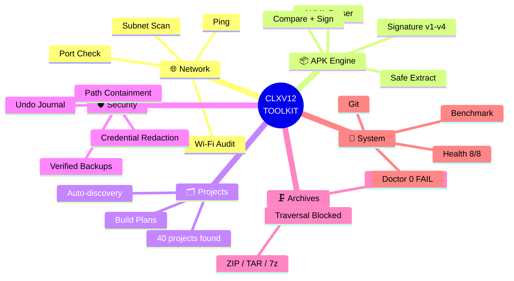

<div align="center">

# CLXV12 TOOLKIT

**Production-oriented, offline-first Termux/Android development suite — single file, standard library only.**

[]()
[]()
[]()
[]()
[]()
[]()

*One file. Zero dependencies. 21 engines. Real security.*

[Features](#-features) - [Install](#-install) - [Usage](#-usage) - [Tests](#-verified-test-results) - [Security](#-security-model) - [Arabic](#-البداية-السريعة-بالعربية)

</div>

---

## Features

| Engine | What it does |
|--------|--------------|
| Projects | Auto-discovers & classifies projects (Node/Vite/Python/Go/Flutter/Android/Web) with evidence-based detection |
| Build | Real build plans per project type — npm, Gradle, Flutter, CMake, Make — with artifact verification |
| APK | Binary AXML parser (no aapt needed), signing-scheme detection (v1-v4), safe extract, compare, sign, install |
| Network | Host discovery (quick/full subnet scan), local port check, ping — restricted to your own network by policy |
| Wi-Fi Audit | Honest security audit of your current connection (SSID, BSSID, DNS, gateway probes) |
| Archives | ZIP/TAR/7z with path-traversal, symlink-escape and compression-bomb protection |
| Security | Symlink-aware path containment (secure_target), TOCTOU-resistant file ops, credential redaction everywhere |
| Backups | Hash-verified snapshots (SHA-256) with tamper detection before any destructive op |
| Undo | Honest journal — only truly reversible operations are recorded |
| 21 engines total | Files, Git, Cleanup, Developer tools, Search, Doctor, Health, Diagnostics, Benchmark, Config, History |

## Install

```bash
pkg install python
curl -L https://raw.githubusercontent.com/CLXV11/CLXV12-TOOLKIT/main/clxv12.py -o ~/clxv12.py
python ~/clxv12.py --selftest
```

Optional (unlocks extras, all features degrade gracefully without them):

```bash
pkg install git termux-api aapt zip
termux-setup-storage
```

## Usage

```bash
python ~/clxv12.py                  # interactive menu (21 engines)
python ~/clxv12.py --help           # full CLI reference
python ~/clxv12.py --doctor         # environment diagnosis with fixes
python ~/clxv12.py --scan           # tools + projects discovery
python ~/clxv12.py --selftest       # 121-test internal suite
python ~/clxv12.py --ports 192.168.1.1 --ports-list common
python ~/clxv12.py --system --json  # machine-readable output (pure JSON)
```

## Verified test results

Executed on a **real Android device** (Termux 0.118, Python 3.14, no root):

| Suite | Result |
|-------|--------|
| Internal self-test | **121/121 PASS** (~5 min, no hangs) |
| Doctor | 12 PASS - 2 WARN - **0 FAIL** |
| Health | 8/8 subsystems healthy |
| Security posture | 7/7 PASS (perms 0o700/0o600, redaction, policies) |
| Archive red-team | traversal / bomb / symlink-escape all blocked |
| Fuzzing | 31 hostile targets + 25 hostile port specs -> **0 crashes** |
| JSON contract | 11/11 CLI commands emit pure JSON |
| Live network | full /24 scan, port checks, Wi-Fi audit — all correct |

## Security model

- **Path containment**: every file op resolves symlinks and validates against approved roots — /etc/passwd, ../ traversal and link escapes are refused
- **TOCTOU resistance**: O_NOFOLLOW opens, fd-based identity checks on backup
- **No shell injection**: all subprocesses use argument lists (shell=False), bounded capture, process-group kill on timeout
- **Privacy**: home path masked in diagnostics, secrets redacted before logs/reports/JSON

## Known limitations (honest list)

- Reverse-DNS and gateway reads are limited by Android permissions (no root -> no MAC addresses, /proc/net/route restricted)
- Wireless encryption mode requires root or Termux:API — the toolkit says UNAVAILABLE instead of guessing
- apksigner/aapt/7z are optional: signing & rich APK metadata report DEPENDENCY_MISSING until installed
- Port checks are policy-restricted to loopback/link-local/your subnet by design (not a bug)

## Roadmap

- [ ] Bounded-DNS hardening (daemon-thread resolver)
- [ ] Backup source-path policy unification
- [ ] Session recording & replay for audits
- [ ] Plugin API for custom engines

## License

MIT — see [LICENSE](LICENSE). Use it, ship it, hack it.

---

## البداية السريعة بالعربية

**CLXV12** — أداة تطوير متكاملة لهاتفك: تدير مشاريعك، تفحص شبكتك، تحلل تطبيقات APK، وتؤرشف بأمان — **ملف واحد بدون أي مكتبات خارجية**.

```bash
pkg install python
python ~/clxv12.py --selftest    # 121 اختباراً — يجب أن ترى 121/121
```

<div align="center">

*Built with discipline on a phone. No excuses.*

</div>



